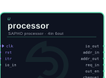
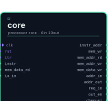
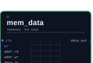
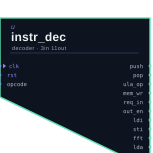
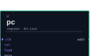
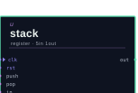

# O processador SAPHO por dentro

Antes de ajustar parâmetros com confiança, vale entender o que exatamente está sendo criado. Esta página descreve a arquitetura do *soft-processor* SAPHO do ponto de vista de quem o usa: o que os parâmetros significam, como a máquina executa o programa e quais são as suas restrições.

Nada aqui precisa ser decorado para usar a plataforma. Mas quem entende a máquina escreve programas melhores para ela, e principalmente entende por que certas construções da linguagem custam caro.

## Visão geral

O SAPHO é um processador de acumulador com arquitetura Harvard.

**Processador de acumulador** significa que não existe um banco de registradores. Existe um único registrador central, o acumulador (ACC), que recebe o resultado de toda operação da unidade lógica e aritmética (ULA). O padrão dominante é buscar um operando na memória de dados, tomar o próprio acumulador como segundo operando e devolver o resultado ao acumulador, com uma pilha de dados fornecendo o segundo operando quando a expressão exige.

**Arquitetura Harvard** significa que as memórias de programa e de dados são fisicamente separadas, cada uma com a sua largura e o seu barramento. O programa não pode se sobrescrever, e instruções e dados são acessados em paralelo.

### Os três traços que definem o estilo da máquina

::::{grid} 1 3 3 3
:gutter: 3

:::{grid-item-card} Totalmente parametrizável

Toda largura é um parâmetro Verilog: da palavra de dados à mantissa e ao expoente do ponto flutuante, passando pelas profundidades das memórias e das pilhas.
:::

:::{grid-item-card} Paga-se só pelo que se usa

Cada instrução do conjunto é um parâmetro booleano. O montador liga somente as instruções que o programa emprega, e o *hardware* das demais é eliminado na geração do circuito.
:::

:::{grid-item-card} Ciclo curto e previsível

Um *pipeline* raso de três estágios, sem *forwarding*. Como a ULA é combinacional e acumula a cada ciclo, nem os saltos condicionais quebram o fluxo.
:::

::::

Esse último ponto merece ênfase, porque é raro. Em instrumentação, saber que qualquer algoritmo executa sem interromper a cadeia de busca, decodificação e execução vale mais do que o desempenho de pico de uma máquina superescalar: o tempo de resposta é determinístico.

## O caminho de dados

O processador executa em três estágios síncronos: busca (F), decodificação (D) e execução (E).

```{mermaid}
flowchart LR
  subgraph F["Busca (F)"]
    PC["Contador de<br>programa"] --> MI["Memória de<br>programa<br><small>instr.mif</small>"]
    MI --> PF["Prefetch"]
    SPI["Pilha de<br>instruções"] --> PC
  end
  subgraph D["Decodificação (D)"]
    PF --> ID["Decodificador<br>de instrução"]
    ID --> SPD["Pilha de<br>dados"]
    ID --> MD["Memória de<br>dados<br><small>data.mif</small>"]
  end
  subgraph E["Execução (E)"]
    MD --> ULA["ULA"]
    SPD --> ULA
    ULA --> ACC["Acumulador"]
    ACC --> ULA
  end
  ENT["Entrada"] --> D
  E --> SAI["Saída"]
  ACC -.->|condição de desvio| PF
```

Repare na seta tracejada: a condição de desvio realimenta a busca a partir do acumulador. É esse laço curto que permite executar saltos condicionais e chamadas de função sem bolhas no *pipeline*.

## Os módulos gerados

O processador compõe-se de poucos módulos Verilog, criados a partir de moldes parametrizáveis que acompanham o YANC. Reconhecê-los é útil ao navegar no PRISM, que desenha cada um com símbolo próprio.

:::{raw} html
<div class="tool-strip">
  <figure><figcaption><code>processor</code><br>o topo</figcaption></figure>
  <figure><figcaption><code>core</code><br>o núcleo</figcaption></figure>
  <figure><figcaption><code>ula</code><br>aritmética</figcaption></figure>
  <figure><figcaption><code>mem_instr</code><br>programa</figcaption></figure>
  <figure><figcaption><code>mem_data</code><br>dados</figcaption></figure>
  <figure><figcaption><code>instr_dec</code><br>decodificador</figcaption></figure>
  <figure><figcaption><code>pc</code><br>contador</figcaption></figure>
  <figure><figcaption><code>stack</code><br>pilhas</figcaption></figure>
  <figure><figcaption><code>addr_dec</code><br>endereços</figcaption></figure>
  <figure><figcaption><code>myFIFO</code><br>fila genérica</figcaption></figure>
</div>
:::

O módulo `processor` é o topo e instancia o núcleo e as duas memórias: `mem_instr`, a memória de programa, somente leitura, carregada com a imagem {file}`<proc>_inst.mif`, e `mem_data`, a memória de dados, carregada com {file}`<proc>_data.mif` e capaz de uma leitura e uma escrita por ciclo.

O núcleo, `core`, reúne o caminho de dados com o acumulador, as pilhas, a busca de instruções e o contador de programa, apoiado pelo decodificador `instr_dec` e pela `ula`, na qual cada operação é um submódulo e somente os usados sobrevivem. Completam o conjunto o decodificador de endereços `addr_dec`, para múltiplas portas, e a FIFO genérica `myFIFO`, útil para acoplar o processador ao mundo externo sem depender de propriedade intelectual de fabricante.

## Os parâmetros fundamentais

Ao criar um processador você escolhe, direta ou indiretamente, os valores da tabela abaixo. Eles aparecem como diretivas no topo do arquivo C± e como `parameter` no Verilog gerado.

:::{list-table} Parâmetros de arquitetura e as diretivas correspondentes
:header-rows: 1
:widths: 20 18 62
:name: tab-parametros

* - Parâmetro
  - Diretiva
  - Significado
* - `NUBITS`
  - `#NUBITS`
  - Largura da palavra de dados. Todo inteiro do programa tem esse tamanho, em complemento de dois
* - `NBMANT`
  - `#NBMANT`
  - Largura da mantissa do ponto flutuante
* - `NBEXPO`
  - `#NBEXPO`
  - Largura do expoente do ponto flutuante
* -
  - `#NDSTAC`
  - Profundidade da pilha de dados
* -
  - `#SDEPTH`
  - Profundidade da pilha de sub-rotinas
* -
  - `#NUIOIN`
  - Número de portas de entrada
* -
  - `#NUIOOU`
  - Número de portas de saída
* -
  - `#NUGAIN`
  - Constante de divisão da função `norm()`
* -
  - `#FFTSIZ`
  - Tamanho da FFT, $2^{\texttt{FFTSIZ}}$ pontos, no endereçamento com reversão de bits
:::

:::{danger}
A palavra precisa comportar exatamente o formato de ponto flutuante: `NUBITS` deve ser igual a `NBMANT` mais `NBEXPO` mais um, o bit de sinal. A AURORA valida essa igualdade no formulário de criação e recusa combinações inválidas.
:::

## Entrada, saída e o mundo externo

O processador conversa com o exterior por portas numeradas, criadas conforme `#NUIOIN` e `#NUIOOU` e acessadas no programa por `in()`, `out()`, `fin()` e `fout()`. No *hardware*, cada porta vira sinais de dados e de controle no topo do módulo `processor`; é por eles que o projeto de FPGA conecta o processador a conversores, FIFOs e outros blocos.

Dois recursos opcionais completam a interface:

A interrupção
: Faz o processador desviar para um ponto configurado do programa quando o pino `itr` pulsa, marcado no código pela diretiva `#PRACA`.

O marcador `#TOAQUI`
: Gera um pino chamado `cheguei`, pulsado sempre que o programa passa pelo ponto marcado, o que permite sincronizar *hardware* externo com fases do algoritmo.

## Por que não há recursão

Esta é a restrição que mais confunde quem chega do *software*, e a explicação está na arquitetura.

Cada variável do programa, incluindo parâmetros e locais, vive em um endereço fixo e único da memória de dados. Não há quadros de pilha: a pilha de sub-rotinas guarda endereços de retorno, não contextos. Uma função que chamasse a si mesma sobrescreveria os próprios dados na segunda entrada.

A contrapartida é valiosa: é justamente esse endereçamento fixo que permite à AURORA mostrar cada variável pelo nome nas formas de onda, ciclo a ciclo. Você troca recursão por observabilidade total, o que em projeto de *hardware* costuma ser o melhor negócio. Quando o algoritmo é essencialmente recursivo, o caminho C++ atende, conforme {doc}`../linguagem/avancado`.

## Um processador por tarefa

Como cada processador é gerado sob medida, o padrão de projeto no SAPHO difere do mundo dos processadores fixos. Em vez de uma máquina grande que faz tudo, criam-se várias máquinas pequenas, uma por tarefa, conectadas por um *top-level* em Verilog.

```{mermaid}
flowchart LR
  SIG["Sinal de<br>entrada"] --> P1["Processador A<br><small>detecta eventos</small>"]
  SIG --> FIFO["FIFO"]
  P1 -->|gatilho| FSM["Máquina de<br>estados"]
  FSM -->|interrupção| P2["Processador B<br><small>calcula a métrica</small>"]
  FIFO -->|amostras| P2
  P2 --> OUT["Resultado"]
```

O diagrama acima é a forma de um caso real do laboratório: um detector de novidade no qual um processador segmenta o sinal pelos cruzamentos por zero e dispara, por interrupção, um segundo processador que drena a FIFO e mede a distância até uma referência.

A AURORA suporta esse fluxo diretamente. Um projeto pode conter quantos processadores forem necessários, cada um com a sua pasta, o seu fonte e os seus parâmetros, todos integrados por um *top-level* e um *testbench* comuns, conforme {doc}`../uso/projetos`.

## Leitura relacionada

- {doc}`ponto-flutuante` detalha o formato numérico próprio e a precisão que se pode esperar dele.
- {doc}`instrucoes` lista as famílias de *opcodes* e ensina a ler as trilhas de *assembly* nas ondas.
- {doc}`../linguagem/avancado` mostra o custo em área de cada construção da linguagem.
