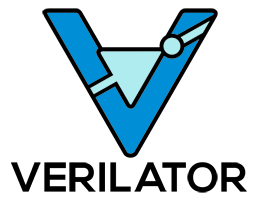
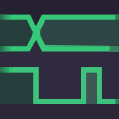
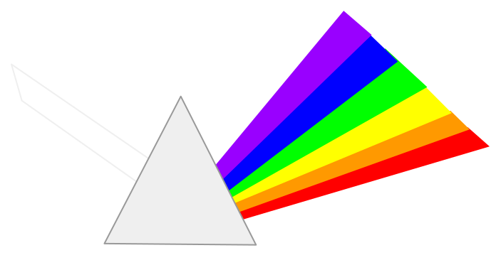

# AURORA — manual de uso

<div class="hero">
<span class="version-pill">Versão documentada: 6.3.2</span>

Este manual ensina a usar a AURORA do zero: instalar, criar um projeto, gerar um processador SAPHO sob medida, escrever o algoritmo em C±, compilar, simular e olhar o circuito por dentro. Nenhum conhecimento prévio da plataforma é assumido. Alguma familiaridade com a linguagem C e com a ideia geral de circuitos digitais torna a leitura mais confortável, mas não é pré-requisito.

<div class="hero-actions">
  <a class="pdf-download-button" href="_static/downloads/AURORA-Manual-6.3.2.pdf" download="AURORA-Manual-6.3.2.pdf">
    <span class="pdf-download-title">Baixar manual em PDF</span>
    <span class="pdf-download-meta">Documento completo em formato A4</span>
  </a>
</div>
</div>

:::{note}
Este manual descreve a AURORA 6.3.2 para Windows 10 e 11. Para a versão exata, o commit e o método usado na apuração, veja {doc}`sobre/escopo`.
:::

## Por onde começar

Se esta é a sua primeira vez, siga a trilha na ordem: entenda {doc}`o que é a plataforma <inicio/o-que-e>`, {doc}`instale <inicio/instalacao>`, {doc}`conheça a janela <inicio/tour-interface>` e faça o {doc}`primeiro projeto <inicio/primeiro-projeto>`, um filtro de média móvel construído do começo ao fim. São cerca de trinta minutos até ver o seu próprio processador rodando na forma de onda.

Se você já tem um projeto em andamento, use o menu lateral para ir direto à tarefa. As páginas de referência reúnem diretivas, biblioteca, atalhos e sintomas de falha para consulta rápida, sem repetir o tutorial.

::::{grid} 1 2 2 3
:gutter: 3

:::{grid-item-card} Primeiros passos
:link: inicio/o-que-e
:link-type: doc

O que é um *soft-processor*, o que cada peça da plataforma faz e como instalar.
:::

:::{grid-item-card} Primeiro projeto
:link: inicio/primeiro-projeto
:link-type: doc

Tutorial completo: do projeto vazio ao processador simulado, passo a passo.
:::

:::{grid-item-card} A linguagem C±
:link: linguagem/index
:link-type: doc

Tipos, operadores, entrada e saída, biblioteca e notação de Dirac.
:::

:::{grid-item-card} O processador
:link: arquitetura/processador
:link-type: doc

Como a máquina executa o seu programa e o que cada parâmetro significa.
:::

:::{grid-item-card} Fluxo Verilog
:link: fluxos/verilog
:link-type: doc

Escreva ou importe RTL, valide, simule e analise sem passar pelo C±.
:::

:::{grid-item-card} Resolver problemas
:link: referencia/diagnostico
:link-type: doc

Botão desabilitado, compilação que falha, onda vazia, PRISM que recusa.
:::

::::

## As ferramentas que você vai usar

A AURORA não substitui as ferramentas consagradas de projeto digital: ela as reúne e as aciona por você. Todas acompanham a instalação, e nenhuma exige licença.

:::{raw} html
<div class="tool-strip">
  <figure><figcaption>AURORA<br>a IDE</figcaption></figure>
  <figure><figcaption>YANC<br>compiladores</figcaption></figure>
  <figure><figcaption>Icarus<br>simulação</figcaption></figure>
  <figure><figcaption>Verilator<br>simulação rápida</figcaption></figure>
  <figure><figcaption>GTKWave<br>formas de onda</figcaption></figure>
  <figure><figcaption>Surfer<br>formas de onda</figcaption></figure>
  <figure><figcaption>Yosys<br>síntese</figcaption></figure>
  <figure><figcaption>PRISM<br>visualizador RTL</figcaption></figure>
  <figure><figcaption>cocotb<br>testes em Python</figcaption></figure>
</div>
:::

## O caminho completo, em um diagrama

O percurso abaixo é o mesmo em todo projeto SAPHO, e este manual o segue nessa ordem. Você escreve apenas o bloco à esquerda; a AURORA cuida do resto.

```{mermaid}
flowchart LR
  CMM["Algoritmo C±<br>(.cmm)"] --> YANC["Cadeia YANC<br>cmmcomp · appcomp · asmcomp"]
  YANC --> HW["Processador em Verilog<br>+ memórias .mif"]
  YANC --> TB["Testbench gerado"]
  HW --> SIM["Simulação<br>Icarus ou Verilator"]
  TB --> SIM
  SIM --> WAVE["Formas de onda<br>GTKWave ou Surfer"]
  HW --> PRISM["Diagrama RTL<br>PRISM"]
  HW --> FPGA["Síntese em FPGA<br>fora da AURORA"]
```

A única etapa que acontece fora da AURORA é a última: levar o Verilog e as imagens de memória à ferramenta do fabricante do FPGA, como o Quartus ou o Vivado, para a gravação física.

```{toctree}
:maxdepth: 2
:caption: Primeiros passos

inicio/o-que-e
inicio/instalacao
inicio/tour-interface
inicio/primeiro-projeto
```

```{toctree}
:maxdepth: 2
:caption: Projetos e processadores

uso/projetos
uso/processadores
uso/editor
uso/arquivos-verilog
uso/terminais
uso/source-control
```

```{toctree}
:maxdepth: 2
:caption: A linguagem C±

linguagem/index
linguagem/diretivas
linguagem/tipos-operadores
linguagem/io-biblioteca
linguagem/avancado
```

```{toctree}
:maxdepth: 2
:caption: O processador SAPHO

arquitetura/processador
arquitetura/ponto-flutuante
arquitetura/instrucoes
```

```{toctree}
:maxdepth: 2
:caption: Compilar, simular e analisar

fluxos/index
fluxos/verilog
fluxos/processador-sapho
fluxos/compilacao
fluxos/simulacao
exemplos/galeria-testbenches
fluxos/ondas
fluxos/prism
```

```{toctree}
:maxdepth: 2
:caption: Aurora Intelligence

ia/visao-geral
ia/provedores
ia/ferramentas
ia/mcp-cli
```

```{toctree}
:maxdepth: 2
:caption: Configuração e ajuda

configuracao/preferencias
referencia/diretivas
referencia/biblioteca
referencia/formatos
referencia/atalhos
referencia/diagnostico
```

```{toctree}
:maxdepth: 1
:caption: Apêndices

glossario
sobre/ecossistema
sobre/escopo
```
