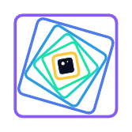
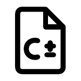

# O que é o SAPHO

O SAPHO (*Scalable-Architecture Processor for Hardware Optimization*) é uma plataforma completa para criar, programar, simular e visualizar *soft-processors*. Você escreve um programa em uma linguagem parecida com C, chamada C± (lê-se "C mais-menos"), e a plataforma gera um processador dedicado em Verilog, feito sob medida para aquele programa e pronto para ser gravado em um FPGA. Tudo acontece dentro de um único aplicativo de desktop, a IDE AURORA, que roda localmente no Windows e não depende de nuvem.

Se a frase acima tem termos desconhecidos, esta página é o lugar certo para começar. Ela explica os conceitos na ordem em que eles importam.

## O que é um soft-processor

O processador do seu computador é um circuito fixo. A arquitetura dele foi decidida na fábrica, gravada em silício, e não muda: a largura da palavra, o conjunto de instruções e o número de registradores são os que são.

Um *soft-processor* é diferente. Ele é um processador descrito em uma linguagem de descrição de *hardware* (HDL, do inglês *Hardware Description Language*), no caso o Verilog, e implementado na malha reconfigurável de um FPGA (*Field-Programmable Gate Array*), um circuito integrado cujas conexões internas podem ser reprogramadas. A arquitetura passa a ser uma escolha do projetista, que pode alterá-la e recompilá-la em minutos.

O SAPHO leva essa ideia ao extremo, com um princípio que vale a pena guardar desde já:

:::{important}
O processador gerado contém apenas o *hardware* que o seu programa usa. Se o programa não divide, o divisor não existe no circuito final. Se não usa ponto flutuante, nenhuma lógica de ponto flutuante é gerada.
:::

A consequência é relevante e um pouco surpreendente: o seu programa não é apenas executado sobre uma máquina pré-existente, ele *determina* a máquina. O resultado é um processador enxuto e previsível, feito para instrumentação científica e para processamento de sinais em tempo real, no qual cada elemento lógico economizado tem valor.

## As peças da plataforma

O nome SAPHO designa tanto o processador quanto o guarda-chuva que reúne os componentes. Vale conhecer cada peça antes de abrir o aplicativo, porque os nomes aparecem o tempo todo na interface.

::::::{grid} 1 2 2 2
:gutter: 3

:::::{grid-item-card}

:::{raw} html

:::

**AURORA**
^^^
A IDE de desktop, o programa que você instala e abre. Nela vivem o editor, o gerenciador de projetos, os botões de compilação e simulação, os terminais e os visualizadores. É a única interface gráfica do ecossistema.
:::::

:::::{grid-item-card}

:::{raw} html

:::

**YANC**
^^^
*Yet Another Compiler*, a suíte de compiladores que trabalha por baixo dos panos. Ela traduz o programa C± (ou C++) no processador em Verilog, nas imagens de memória e no *testbench*. Você nunca a chama diretamente.
:::::

:::::{grid-item-card}

:::{raw} html

:::

**O processador SAPHO**
^^^
O circuito parametrizável que o YANC emite: acumulador único, arquitetura Harvard e *pipeline* de três estágios. Descrito em {doc}`../arquitetura/processador`.
:::::

:::::{grid-item-card}

:::{raw} html

:::

**A linguagem C±**
^^^
O dialeto de C no qual você escreve o algoritmo, com números complexos como tipo nativo e álgebra linear em notação de Dirac. Arquivos com extensão {file}`.cmm`. Descrita em {doc}`../linguagem/index`.
:::::

::::::

Em volta desse núcleo orbitam as ferramentas de apoio, todas de código aberto e todas empacotadas junto com a instalação:

Icarus Verilog
: O simulador padrão. Interpreta o Verilog e expõe todos os sinais internos do processador, o que faz dele o motor da depuração.

Verilator
: Um simulador que converte o circuito em C++ e compila um executável nativo, de cinco a dez vezes mais rápido em simulações longas, ao custo de expor apenas os sinais do topo.

GTKWave e Surfer
: Os dois visualizadores de formas de onda, nos quais você lê o comportamento do circuito ao longo do tempo. Veja {doc}`../fluxos/ondas`.

Yosys e PRISM
: O Yosys sintetiza o circuito e o PRISM (*Processor Rendering Interface for Schematic Models*) o desenha como um diagrama navegável de blocos e conexões. Veja {doc}`../fluxos/prism`.

cocotb
: Um arcabouço que permite escrever o banco de testes inteiramente em Python, em vez de Verilog, aproveitando bibliotecas como NumPy e SciPy na verificação. Veja {doc}`../fluxos/simulacao`.

Aurora Intelligence
: A assistente de inteligência artificial integrada, capaz de conversar sobre o projeto e de agir sobre a IDE por ferramentas com permissão controlada. Veja {doc}`../ia/visao-geral`.

## O fluxo de trabalho de ponta a ponta

O caminho de quem usa o SAPHO é sempre o mesmo, e este manual o percorre nessa ordem.

```{mermaid}
flowchart TD
  P["1 · Criar o projeto<br><small>uma pasta e um arquivo .spf</small>"]
  Q["2 · Criar o processador<br><small>nome e parâmetros de arquitetura</small>"]
  R["3 · Escrever o algoritmo<br><small>o programa em C±</small>"]
  S["4 · Compilar<br><small>o YANC gera Verilog, memórias e testbench</small>"]
  T["5 · Simular<br><small>Icarus ou Verilator executam o circuito</small>"]
  U["6 · Inspecionar<br><small>formas de onda e diagrama RTL</small>"]
  V["7 · Sintetizar no FPGA<br><small>Quartus ou Vivado, fora da AURORA</small>"]
  P --> Q --> R --> S --> T --> U --> V
  U -.->|corrigir e repetir| R
```

Repare na seta tracejada. Na prática você não percorre o caminho uma vez: você dá voltas nele. Escreve, compila, olha a onda, descobre que a saída satura no lugar errado, volta ao código. A agilidade dessa volta é justamente o que a AURORA existe para melhorar, reduzindo a seis ferramentas de linha de comando a um único botão.

## Um exemplo condutor

Para que cada conceito apareça em contexto, este manual constrói um processador do zero e o acompanha até a forma de onda final: o `media_movel`, um filtro de média móvel que lê amostras de um sinal por uma porta de entrada, calcula a média das últimas quatro e escreve o resultado em uma porta de saída.

É um exemplo pequeno, de propósito, mas exercita o essencial: entrada e saída, aritmética, uso de vetor, laço principal e simulação com estímulo externo. Ele nasce no {doc}`primeiro-projeto` e reaparece nas páginas de linguagem, compilação e formas de onda.

## Quem faz a plataforma

O SAPHO é desenvolvido e mantido pelo NIPS-CERN, o Núcleo de Instrumentação e Processamento de Sinais da Universidade Federal de Juiz de Fora (UFJF), em Minas Gerais. O laboratório atua em parceria com o CERN (*Conseil Européen pour la Recherche Nucléaire*) no experimento ATLAS do LHC (*Large Hadron Collider*), onde técnicas de processamento de sinais em FPGA, o habitat natural do SAPHO, são aplicadas à instrumentação dos calorímetros.

A plataforma também sustenta o ensino na disciplina de Dispositivos Lógicos Programáveis da UFJF, na qual os alunos projetam, simulam e inspecionam processadores de ponta a ponta sem depender de licenças proprietárias. Se você chegou aqui por essa disciplina, está no lugar certo.

:::{seealso}
Para o histórico do ecossistema, os projetos que o usam e as publicações associadas, veja {doc}`../sobre/ecossistema`.
:::

## O próximo passo

Com o vocabulário assentado, siga para {doc}`instalacao`. A instalação é de um clique e traz a cadeia de ferramentas inteira embutida, de modo que nada além do instalador precisa ser baixado.
