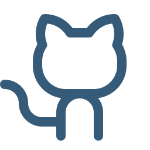
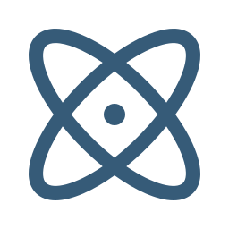
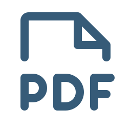
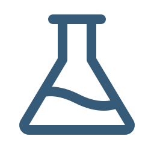
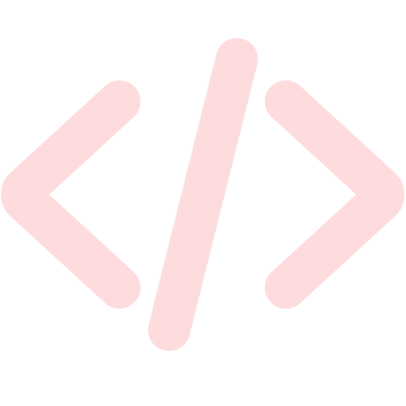

# Links e onde encontrar a gente

Tudo o que orbita este manual em um lugar só: os endereços oficiais da plataforma, do laboratório e das ferramentas que vêm na caixa.

## As duas casas

O NIPS-CERN, Núcleo de Instrumentação e Processamento de Sinais, tem dois endereços, e é a distância entre eles que explica a plataforma: a pesquisa nasce em Juiz de Fora e é usada em Genebra.

::::{grid} 1 2 2 2
:gutter: 3

:::{grid-item-card}

NIPS, UFJF
^^^
Departamento de Engenharia Elétrica, PPEE  
R. José Lourenço Kelmer, s/n  
Juiz de Fora, MG 36036-900, Brasil

[luciano.andrade@ufjf.br](mailto:luciano.andrade@ufjf.br)
:::

:::{grid-item-card}

Route Salam, CERN
^^^
Esplanade des Particules 1  
CH-1211 Genève 23, Suisse

[chrysthofer.afonso@cern.ch](mailto:chrysthofer.afonso@cern.ch)
:::

::::

Para assuntos gerais, parcerias e vagas: [contact@nipscern.com](mailto:contact@nipscern.com).

## Na rede

::::{grid} 1 2 2 3
:gutter: 3

:::{grid-item-card}
:link: https://www.nipscern.com

Site do NIPS-CERN
^^^
nipscern.com. Projetos, publicações, notícias e a equipe. É de lá que sai o instalador do SAPHO.
:::

:::{grid-item-card}
:link: https://www.instagram.com/nipscern/

Instagram
^^^
@nipscern. O dia a dia do laboratório: bancada, viagens ao CERN, defesas, resultados novos. É por onde a gente conversa mais rápido.
:::

:::{grid-item-card}
:link: https://github.com/nipscernlab

GitHub
^^^
A organização nipscernlab: o código do SAPHO, da AURORA, do YANC e deste manual, tudo aberto.
:::

:::{grid-item-card}
:link: https://gitlab.com/nips-cern

GitLab
^^^
Os projetos que vivem no GitLab, entre eles o nosso fork do Surfer.
:::

:::{grid-item-card}
:link: https://www.nipscern.com/cern.html

NIPS-CERN e o ATLAS
^^^
A colaboração com o CERN, o calorímetro TileCal do experimento ATLAS e o que a nossa eletrônica faz lá dentro.
:::

:::{grid-item-card}
:link: https://www.nipscern.com/about.html

Quem faz
^^^
As duas casas do laboratório: o NIPS, na UFJF, em Juiz de Fora, e a Route Salam, no CERN, em Genebra.
:::

::::

## A plataforma

::::{grid} 1 2 2 3
:gutter: 3

:::{grid-item-card}
:link: https://www.nipscern.com/projects/sapho

Página do SAPHO
^^^
A apresentação da plataforma, com o processador desenhado bloco a bloco e o download da última versão.
:::

:::{grid-item-card}
:link: https://github.com/nipscernlab/sapho/releases/latest

Baixar a última versão
^^^
O instalador completo, direto do GitHub: IDE, compiladores, simuladores e visualizadores em um arquivo só.
:::

:::{grid-item-card}
:link: https://www.nipscern.com/projects/aurora

Página da AURORA
^^^
A IDE por dentro: editor, terminais, Aurora Intelligence e o resto da janela onde você trabalha.
:::

:::{grid-item-card}
:link: https://www.nipscern.com/projects/yanc

Página do YANC
^^^
Os compiladores que traduzem o C± em processador: cmmcomp, appcomp e asmcomp.
:::

:::{grid-item-card}
:link: https://github.com/nipscernlab/docs_aurora

O código deste manual
^^^
Achou um erro ou quer sugerir um capítulo? O manual é um repositório aberto, e uma issue basta.
:::

:::{grid-item-card}
:link: https://www.nipscern.com/qa.html

Perguntas e respostas
^^^
As dúvidas que mais chegam, com resposta curta. Inclui como colaborar e como trabalhar conosco.
:::

::::

## Leitura

::::{grid} 1 2 2 3
:gutter: 3

:::{grid-item-card}
:link: https://cdn.nipscern.com/publications/ieee-2026-soft-core-processors.pdf

O artigo da plataforma
^^^
SAPHO: An FPGA Customizable Implementation (IEEE, 2026). A arquitetura e os resultados em FPGA.
:::

:::{grid-item-card}
:link: https://cdn.nipscern.com/publications/sbai-2025-simulador-de-pulsos-do-tilecal.pdf

O SAPHO em produção
^^^
O simulador de pulsos do TileCal em tempo real (SBAI, 2025), rodando na eletrônica do ATLAS.
:::

:::{grid-item-card}
:link: https://cdn.nipscern.com/publications/enemc-2025-implementacao-de-fractal.pdf

Fractais em FPGA
^^^
Implementação de Fractal em FPGA usando o SAPHO (ENMC, 2025). O caso mais visual de todos, e ótimo para aula.
:::

:::{grid-item-card}
:link: https://www.nipscern.com/publications

Todas as publicações
^^^
A produção completa do laboratório, de 2001 até hoje, com os PDFs.
:::

:::{grid-item-card}
:link: https://www.nipscern.com/news/

Notícias
^^^
O que anda acontecendo por aqui: versões novas, congressos, gente chegando.
:::

:::{grid-item-card}
:link: publicacoes.html

Leituras deste manual
^^^
A seleção comentada, capítulo por capítulo, do que vale ler junto com cada parte.
:::

::::

## As ferramentas que vêm na caixa

Todas de código aberto, todas instaladas junto com o SAPHO. Os links vão para os projetos originais, que merecem a visita.

::::{grid} 2 3 3 4
:gutter: 3

:::{grid-item-card}
:link: https://steveicarus.github.io/iverilog/

Icarus Verilog
^^^
O simulador padrão.
:::

:::{grid-item-card}
:link: https://www.veripool.org/verilator/

Verilator
^^^
Simulação rápida.
:::

:::{grid-item-card}
:link: https://gtkwave.sourceforge.net/

GTKWave
^^^
As formas de onda.
:::

:::{grid-item-card}
:link: https://gitlab.com/nips-cern/surfer-aurora

Surfer
^^^
Ondas, no nosso fork.
:::

:::{grid-item-card}
:link: https://yosyshq.net/yosys/

Yosys
^^^
A síntese que o PRISM desenha.
:::

:::{grid-item-card}
:link: https://www.cocotb.org/

cocotb
^^^
Testbenches em Python.
:::

:::{grid-item-card}
:link: https://code.visualstudio.com/api/monaco

Monaco
^^^
O editor dentro da AURORA.
:::

:::{grid-item-card}
:link: https://www.electronjs.org/

Electron
^^^
A base da aplicação.
:::

::::

## Falar com a gente

| Assunto | Onde |
|---|---|
| Dúvida sobre a plataforma ou o manual | [contact@nipscern.com](mailto:contact@nipscern.com) |
| Coordenação do laboratório | [luciano.andrade@ufjf.br](mailto:luciano.andrade@ufjf.br) |
| A plataforma e este manual | [chrysthofer.afonso@cern.ch](mailto:chrysthofer.afonso@cern.ch) |
| Defeito na AURORA | A aba {guilabel}`Sobre` das configurações monta o relato com o diagnóstico da instalação, ou abra uma issue no [repositório da AURORA](https://github.com/nipscernlab/aurora/issues) |
| Erro neste manual | Uma issue em [docs_aurora](https://github.com/nipscernlab/docs_aurora/issues) |
| Parcerias, pesquisa, vagas | [contact@nipscern.com](mailto:contact@nipscern.com) e a [página Sobre](https://www.nipscern.com/about.html) |

O laboratório soma 147 publicações no registro, de 2001 a 2026, com 32 orientações concluídas e 18 pessoas hoje. Os números vivos ficam no [site](https://www.nipscern.com).
