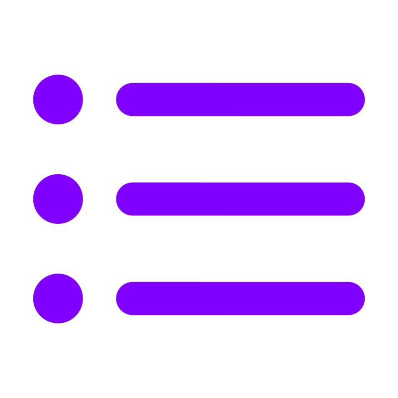

# O ecossistema SAPHO

Esta página situa a AURORA no conjunto de que ela faz parte: quem desenvolve a plataforma, quais componentes a formam, onde ela é usada e como as peças se relacionam. É leitura de contexto, não de procedimento.

## O laboratório

O SAPHO é desenvolvido e mantido pelo NIPS-CERN, o Núcleo de Instrumentação e Processamento de Sinais da Universidade Federal de Juiz de Fora, em Minas Gerais, em parceria com o CERN (*Conseil Européen pour la Recherche Nucléaire*).

O grupo atua no experimento ATLAS do LHC (*Large Hadron Collider*), no qual feixes de prótons se cruzam a uma taxa de 40 MHz. Processar esses sinais em tempo real e com baixa latência exige FPGAs, e quando o algoritmo a embarcar é extenso, recorre-se a processadores embarcados. Para não desperdiçar área lógica com arquiteturas fixas, o laboratório desenvolveu o SAPHO: um núcleo cuja arquitetura é gerada sob demanda, sintetizando em *hardware* apenas os recursos exigidos por cada aplicação.

Todo o ecossistema é de código aberto, hospedado na organização `nipscernlab` no GitHub. O canal oficial de distribuição para o usuário final é [nipscern.com/sapho](https://nipscern.com/sapho).

## Os componentes

:::{raw} html
<div class="tool-strip">
  <figure><figcaption>AURORA<br>a IDE</figcaption></figure>
  <figure><figcaption>YANC<br>compiladores</figcaption></figure>
  <figure><figcaption>PRISM<br>visualizador RTL</figcaption></figure>
  <figure><figcaption>Electron<br>base da IDE</figcaption></figure>
  <figure><figcaption>Monaco<br>editor</figcaption></figure>
  <figure><figcaption>Icarus<br>simulação</figcaption></figure>
  <figure><figcaption>Verilator<br>simulação rápida</figcaption></figure>
  <figure><figcaption>GTKWave<br>ondas</figcaption></figure>
  <figure><figcaption>Surfer<br>ondas</figcaption></figure>
  <figure><figcaption>Yosys<br>síntese</figcaption></figure>
  <figure><figcaption>netlistsvg<br>desenho</figcaption></figure>
  <figure><figcaption>Python<br>cocotb</figcaption></figure>
  <figure><figcaption>MCP<br>agentes de IA</figcaption></figure>
</div>
:::

### Desenvolvidos pelo laboratório

SAPHO
: O processador *soft-core* de arquitetura gerada sob demanda, descrito em {doc}`../arquitetura/processador`.

C±
: A linguagem de médio nível derivada de C, estendida com tipo complexo nativo e notação de Dirac para álgebra linear, documentada em {doc}`../linguagem/index`.

YANC
: A cadeia de compiladores, escrita em C com o auxílio das ferramentas Flex e Bison, que traduz C± e C++ até Verilog sintetizável.

AURORA
: A IDE construída sobre o Electron, que orquestra a cadeia inteira e é a única interface gráfica do ecossistema.

PRISM
: O visualizador de RTL embutido, apoiado no Yosys e no netlistsvg, descrito em {doc}`../fluxos/prism`.

Aurora Intelligence
: A assistente de IA especializada na linguagem e no fluxo, descrita em {doc}`../ia/visao-geral`.

Dagr
: O painel de controle de versão integrado, descrito em {doc}`../uso/source-control`.

### Ferramentas de terceiros empacotadas

Todas acompanham a instalação, em versões validadas em conjunto, e nenhuma exige licença: Icarus Verilog e Verilator para simulação, Yosys para síntese, GTKWave e Surfer para formas de onda, o editor Monaco, os servidores de linguagem Verible e slang, o clang-format e um Python com cocotb, NumPy e SciPy.

O catálogo completo com as respectivas licenças está em {menuselection}`Configurações do Aurora --> Sobre`.

## Como as peças se encaixam

```{mermaid}
flowchart TB
  subgraph IDE["AURORA · processo de renderização"]
    ED["Editor Monaco"]
    TR["Árvore de arquivos"]
    TM["Terminais"]
    AI["Painel da assistente"]
  end
  subgraph MAIN["AURORA · processo principal"]
    ORQ["Orquestração de<br>processos e arquivos"]
    PR["PRISM<br><small>Yosys + netlistsvg</small>"]
  end
  IDE <-->|IPC| MAIN
  ORQ --> CC["cmmcomp"] --> AC["appcomp"] --> AS["asmcomp"]
  AS --> IV["iverilog + vvp<br>ou Verilator"]
  IV --> GW["GTKWave<br>ou Surfer"]
  AS --> PR
```

A separação em dois processos vem do Electron, o arcabouço que une, em um único executável, o motor de renderização Chromium, que desenha a interface, e o ambiente Node.js, que tem acesso ao sistema de arquivos. É essa separação que permite à IDE invocar compiladores e simuladores como processos filhos, algo que um navegador comum, isolado em ambiente restrito, não poderia fazer.

## Onde a plataforma é usada

Em pesquisa
: Da geração de fractais em FPGA à simulação de pulsos do calorímetro de telhas do ATLAS em tempo real, passando por unidades de medição fasorial conformes à norma IEC/IEEE 60255-118-1 e por redes neurais convolucionais embarcadas para estimativa de amplitude de sinais.

No ensino
: Na disciplina de Dispositivos Lógicos Programáveis da graduação em Engenharia Elétrica da UFJF, na qual os alunos projetam, simulam e inspecionam processadores de ponta a ponta em um único ambiente, aprendendo os fundamentos do *hardware* digital reconfigurável sem depender de licenças proprietárias.

## O que fica de fora

Vale ser explícito sobre a fronteira. A cobertura aberta da AURORA alcança a modelagem, a simulação e a inspeção estrutural, mas não a implementação física: a síntese dirigida ao dispositivo, o posicionamento e a gravação dependem de informação proprietária sobre a arquitetura interna de cada FPGA e seguem a cargo do ambiente do fabricante, como o Quartus ou o Vivado.

Há também um limite inerente a qualquer simulação: ela valida o modelo do circuito, não o dispositivo físico. Efeitos da implementação real, como violações de temporização após o roteamento, não se manifestam no ambiente ideal, e a validação em ferramenta não dispensa a verificação em *hardware*.

Por fim, a AURORA é especializada no ecossistema SAPHO e na cadeia YANC. A generalização para outros fluxos de projeto não é imediata.

## Para citar a plataforma

Os trabalhos que descrevem a AURORA, o SAPHO e os componentes do ecossistema estão publicados em anais de congressos e periódicos da área. As referências completas e atualizadas ficam na página do projeto em [nipscern.com/projects/aurora](https://www.nipscern.com/projects/aurora).
